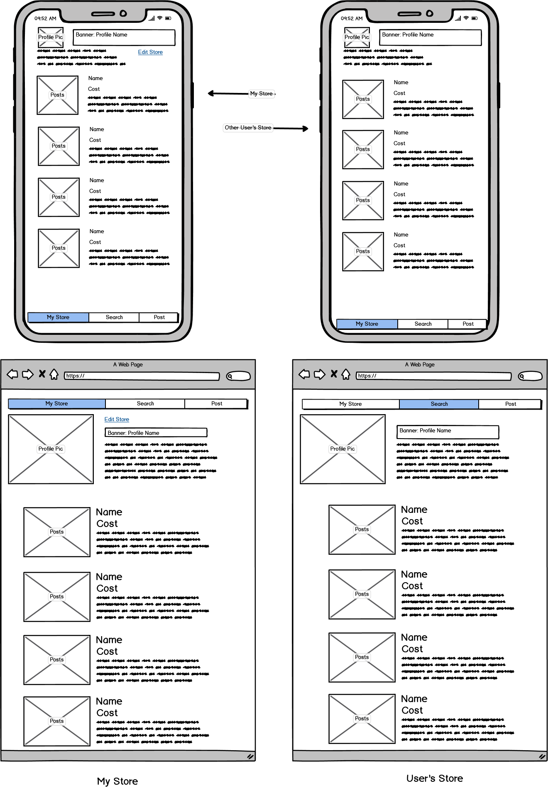
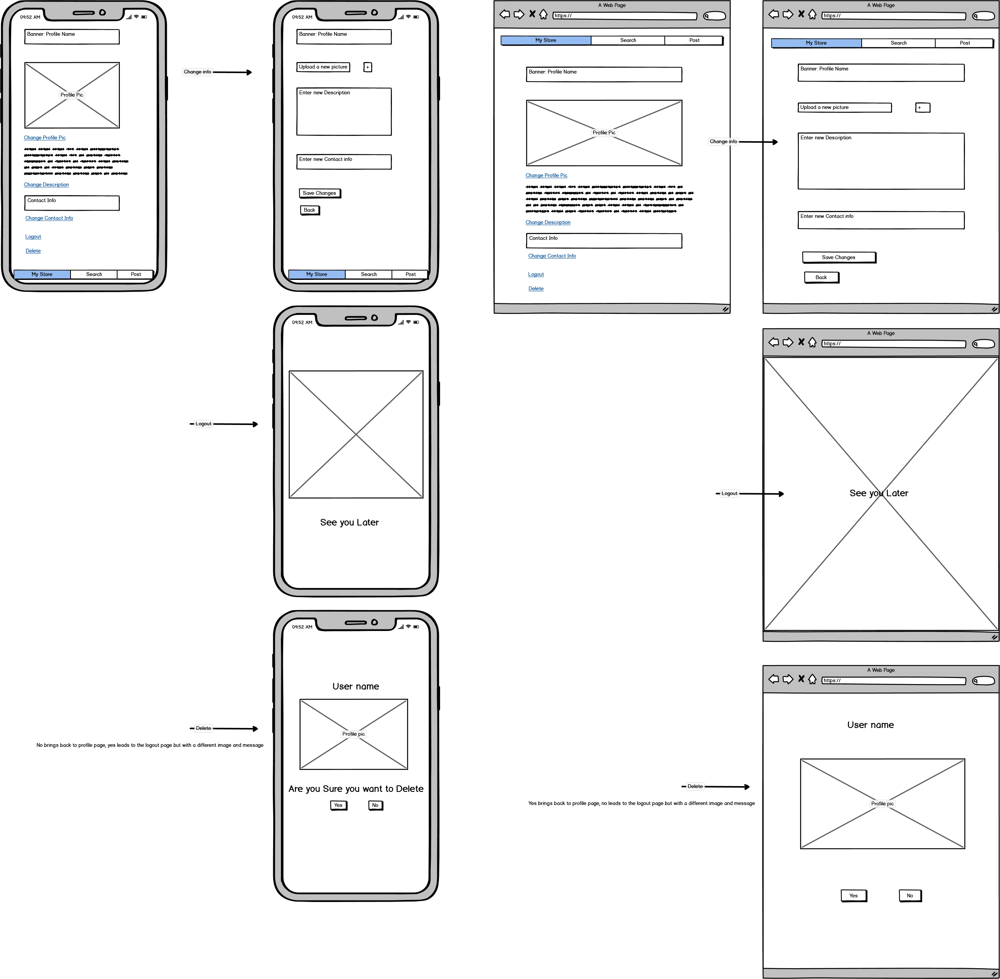
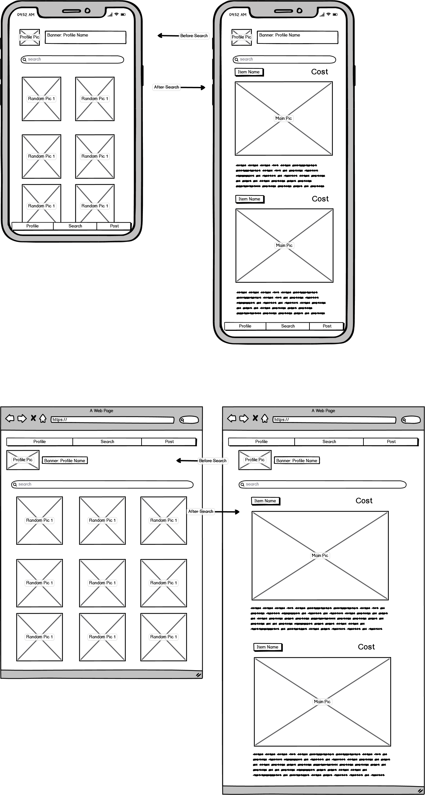
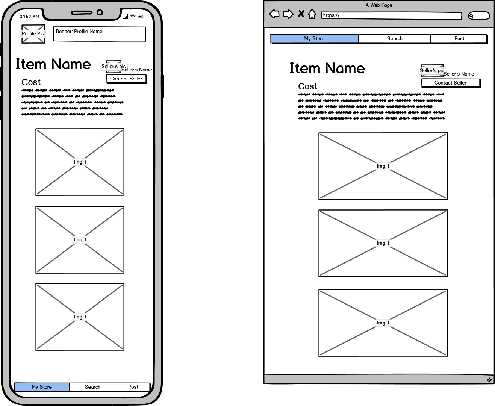
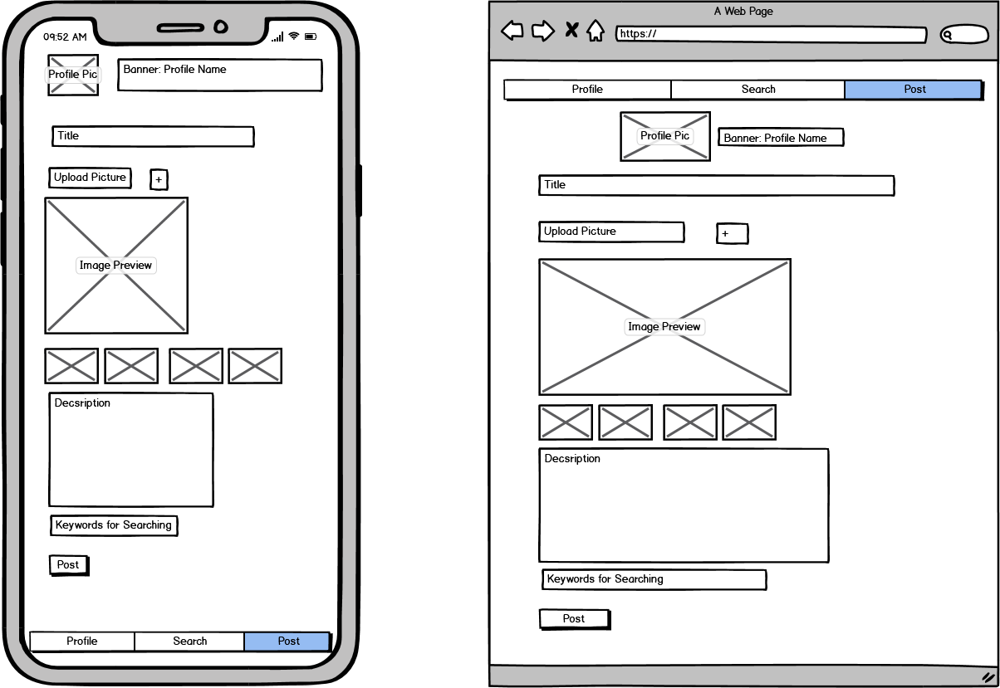

# MarketPlace

## Purpose

This will be a marketplace community app, similar to gumtree. User's will be able to sign up and create a profile for their store (or themselves if they want). They will then be able to upload pictures about what they are trying to sell. They will tag the photos with key words to make them eaesier to search for.
User's will be able to search or just browse the marketplace. If they find an item they like. They will be able to contact the owner.

## Installing

##### If using Ubuntu,

1. Create a new directory and cd into it
2. Clone git repo
3. If not running python 3.8, run the following bash commands
    1. `sudo apt update`
    2. `sudo apt install python3.8`
4. Create a virtual enviornment
    1. `sudo apt-get install python3-pip`
    2. `sudo apt-get install python3-venv`
    3. `python3 -m venv venv`
    4. `source venv/bin/activate`
5. Install the modules in requirements.txt
    1. `cd MarketPlace`
    2. `cd MarketPlace`
    3. `pip install -r requirements.txt`
6. Run the Program
    1. `cd src`
    2. `python main.py`

## Layout
**Sign-in/Create Page**

The first page will be a sign in page. The User will be prompted to enter a username/password which will lead to their profile if entered correctly.

If the User doesn't have an account and would like to create one instead. They will be able to with the create profile button.

This will take the User to a new page where they can create a profile name (this must be unique and will be the primary identifier for users), a profile picture to upload, a short description of themselves or their store if they would like to format their profile that way and some contact info (this will be private however to other users).

Below are the wireframes for both the mobile and desktop versions.

**Profile Page**

Once signed in or profile is created, the user will be brought to the user's profile. Here they will have all the items they are selling with the descriptions and cost

The Profile pages will be similar for all users however for the user signed in, their page will include an edit profile button.

The overall layout for the pages will have a navigation bar listing what page the user is on out of Store, Search, and post. With the current pge being highlighted. This navigation bar will be at the bottom of the screen for mobile and at the top for desktop.

Wireframes are shown below.

**Edit Profile**

For the edit profile feature the User will be taken to a page similar to the create profile layout with links to edit the info. If these are clicked, the user will be take to a age with all the same headers over empty text boxes, these will be filled out and the changes will be updated.

On the edit page there will be an option to logout from the session which will lead to a page saying goodbye.

There will also be a delete profile option which the user can delete theyre profile. If clicked the user will be prompted to make sure this is what they want, if so the profile will be deleted and another page similar to the logout page will be shown with another goodbye message.

Wireframes are shown below.

**Browse**

This page will at first have some random items that the User can click on. There will also be a search bar. Once a search is made which will search keywords through the pictures and display pictures with the relevant keywords. This display format will greatly resemble the feed.

Wireframes are shown below.

**Clicking on a Picture**

When clicking on a picture, The user will be take to a page that is just focused on the item itself and all of its relevant information. The Navigation will remain on the browse feature when on this page.

Wireframes are shown below.

**Post**

This page will be to upload a new Item. There will be all empty fields for the user to fill out and an option for the user to upload multiple pictures.

Wireframes are Shown below.

## Trello 

https://trello.com/b/qEjnUBqe/gumtree